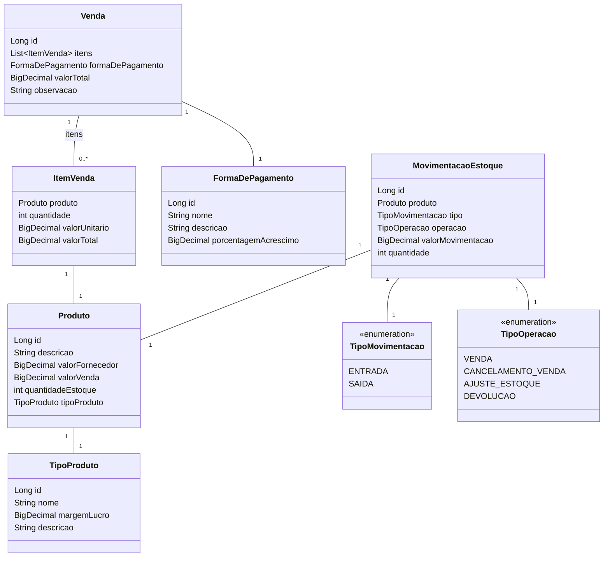

# API de Controle de Estoque
Este projeto é uma API para gestão de estoque, desenvolvida utilizando Java, Spring Boot e Gradle. A API permite gerenciar produtos, vendas, movimentações de estoque, tipos de produtos, formas de pagamento

## 🛠 Tecnologias Utilizadas

- Link do projeto https://frontend-controle-estoque.vercel.app
- Link do https://controle-estoque-z712.onrender.com/swagger-ui/index.html

- Backend
- **Java 21.**
- **Spring Boot (v3.4.2)**: Framework para criação de aplicações Java.
- **Spring Data JPA**: Manipulação de dados com JPA/Hibernate.
- **PostgreSQL**: Banco de dados relacional.
- **SpringDoc OpenAPI**: Documentação da API com Swagger.
- **Lombok**: Redução de boilerplate no código.
- **Bean Validation**: Validação de dados.
### Testes
- **JUnit**: Execução de testes unitários e de integração.
- **Spring Boot Starter Test**: Suporte para testes no Spring.

### Desenvolvimento
- **Spring Boot DevTools**: Ferramenta para facilitar o desenvolvimento.

## 🚀 Funcionalidades
## Funcionalidades

- **Gerenciamento de Produtos: Cadastro, atualização, listagem e exclusão de produtos**.
- **Movimentação de Estoque: Entrada e saída de produtos com base em operações específicas**.
- **Gestão de Vendas: Registro de vendas, cancelamento e cálculo de valores com acréscimos**.
- **Tipos de Produtos: Cadastro e gerenciamento de categorias de produtos**.
- **Formas de Pagamento: Configuração de formas de pagamento com acréscimos**.
- **Relatórios: Listagem de vendas, produtos e movimentações com filtros e paginação**.


## ⚙️ Configuração

1. Configure o banco de dados no arquivo `application.properties`:
   ```properties
   spring.datasource.url=jdbc:postgresql://localhost:5432/controle_estoque
   spring.datasource.username=usuario
   spring.datasource.password=senha
   spring.jpa.hibernate.ddl-auto=update
## 📚 Uso das APIs

### Criar Produto
- **Endpoint**: `POST /produtos`  

#### Exemplo de Requisição:
```http
POST /produtos/
```json
{
	"descricao": "Produto Teste",
	"valorFornecedor": 100.00,
	"quantidadeEstoque": 50,
	"tipoProdutoId": 1
}
```
#### Exemplo de Resposta::
```http
POST /produtos/
```json
{
	"id": 1,
	"descricao": "Produto Teste",
	"valorFornecedor": 100.00,
	"valorVenda": 150.00,
	"quantidadeEstoque": 50,
	"tipoProduto": {
		"id": 1,
		"nome": "Eletrônicos",
		"margemLucro": 50.00,
		"descricao": "Produtos eletrônicos"
	}
}
